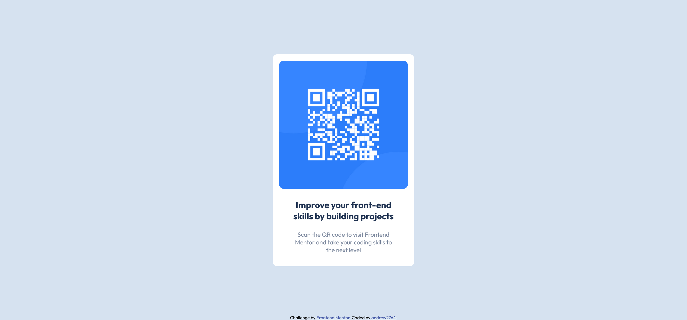

# Frontend Mentor - QR code component solution

This is a solution to the [QR code component challenge on Frontend Mentor](https://www.frontendmentor.io/challenges/qr-code-component-iux_sIO_H). Frontend Mentor challenges help you improve your coding skills by building realistic projects. 


## Overview

### Screenshot



### Links

- Live Site URL: [Github Pages](https://andrew2764.github.io/qr-code-component/)

### Built with

- HTML5
- CSS3

### Continued development

The part that gave me the most trouble was figuring out how to center the component. At first I tried using flexbox to center the component. For some reason, the justify-content property was not working and I could only center it horizontally with align-items.

```css
body {
  display: flex;
  align-items: center;
  justify-content: center;
  flex-direction: column;
}
```

After staring at the css for a while and trying to fiddle with different values and properties on my Firefox dev tools, I gave up on flexbox and settled with using position: absolute and transform: translate directly on the component container element instead.

```css
.container {
  position: absolute;
  left: 50%;
  top: 50%;
  transform: translate(-50%,-50%);
}
```